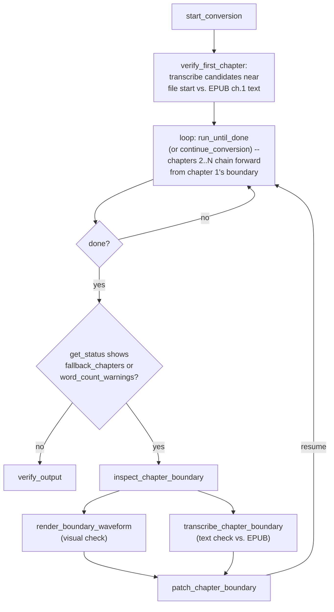

# audiobook_mcp

An MCP server that turns a single-file MP3/M4A audiobook plus its EPUB
into a properly chaptered M4B — the [`audiobook-mp3-to-m4b`](../audiobook-mp3-to-m4b)
skill's pipeline, exposed as MCP tools instead of a script you shell out
to by hand.

Chapter boundaries are found by locating the *real* silence gap at each
chapter transition and anchoring the search for chapter N+1 on chapter
N's actual detected boundary — not on a bookseller's rounded displayed
durations (which drift over a long book) or on EPUB word-count pacing
alone (dialogue-heavy vs. descriptive passages read at different speeds).
Because that chain starts from chapter 1, an unconfirmed guess at chapter
1's own start (most commonly a missed opening-credits/intro segment) would
otherwise throw off every chapter behind it — so before the chain runs at
all, chapter 1's boundary is confirmed by transcribing candidate gaps near
the start of the file (via whisper.cpp) and checking each against the
EPUB's own chapter-1 text (`verify_first_chapter`, on by default; falls
back to a silence-only guess if whisper.cpp isn't configured). See
`audiobook_mcp/pipeline.py`'s module docstring for the full rationale,
including how it filters out the short "decoy" gap some publishers place
a few seconds after the real transition.

## Why this is a *resumable job*, not one blocking tool call

A 20+ hour audiobook can take longer to fully process than most MCP
clients will happily block a single tool call for. So conversion is
modeled as a job: `audiobook_start_conversion` creates it,
`audiobook_continue_conversion` (fine-grained) or `audiobook_run_until_done`
(loops internally) advance it in bounded time chunks and checkpoint to
disk after every unit of progress, and `audiobook_get_status` reads
progress without doing any work. Call `continue_conversion`/`run_until_done`
repeatedly until the response's `"done"` field is `true`. This is the
same checkpoint-and-resume design the underlying skill uses for the same
reason, generalized from a hard 45-second sandbox cap to "whatever your
MCP client is comfortable with."

## Setup

Requires Python 3.10+, `ffmpeg`/`ffprobe` on `PATH`.
`exiftool` is also needed, but only for `audiobook_embed_cover_metadata` --
every other tool works without it (missing `exiftool` is reported clearly
by that one tool, not a silent skip). Likewise,
[`whisper.cpp`](https://github.com/ggerganov/whisper.cpp) is recommended
but not required: build/install it, put its CLI binary (`whisper-cli` or
`whisper-cpp`) on `PATH` (or point `AUDIOBOOK_MCP_WHISPER_BIN` at it
directly), download a GGML model with its `models/download-ggml-model.sh`
script, and set `AUDIOBOOK_MCP_WHISPER_MODEL` to that model file's path.
It's used by `audiobook_transcribe_chapter_boundary` (an on-demand spot
check) and, by default, by `audiobook_start_conversion`'s
`verify_first_chapter` step (an automatic check of chapter 1's boundary
before the rest of the book is aligned). Without it, `verify_first_chapter`
falls back to a silence-only guess and logs a warning instead of failing
the job -- so whisper.cpp is worth setting up for any book that might have
an intro, but nothing breaks without it. No Python speech-recognition
package is installed by this project -- like ffmpeg and exiftool,
whisper.cpp is shelled out to as an external binary, and a missing
binary/model is reported clearly rather than silently skipped.

```bash
cd audiobook_mcp
pip install -e .
# or: pip install -r requirements.txt
```

This server targets **v2.x of the MCP Python SDK** (`mcp>=2.0,<3.0.0`).
v2 renamed `FastMCP` to `MCPServer` (now imported from
`mcp.server.mcpserver`, along with `Context`/`Image`) and changed the
`@mcp.tool()` decorator's `annotations` parameter from a plain dict to a
`mcp.types.ToolAnnotations` object, with `title` moving out to become the
decorator's own `title=` kwarg. `Context.report_progress()`/`.info()` and
the `Image` class kept the same call shape.

### Register with an MCP client

Claude Code / Claude Desktop (`claude_desktop_config.json` or equivalent):

```json
{
  "mcpServers": {
    "audiobook": {
      "command": "python3",
      "args": ["-m", "audiobook_mcp.server"],
      "cwd": "/absolute/path/to/audiobook_mcp"
    }
  }
}
```

Or, after `pip install -e .`, use the installed console script instead of
`-m audiobook_mcp.server`:

```json
{
  "mcpServers": {
    "audiobook": { "command": "audiobook-mcp" }
  }
}
```

## Tools

| Tool | Purpose |
|---|---|
| `audiobook_inspect_epub` | Preview an EPUB's chapters/metadata/cover without starting a job. |
| `audiobook_start_conversion` | Create (or resume) a job; runs the fast EPUB-parse stage only. |
| `audiobook_continue_conversion` | Advance a job by one bounded chunk of work. |
| `audiobook_run_until_done` | Loop `continue_conversion` internally up to a time cap. |
| `audiobook_get_status` | Read a job's progress without doing work. |
| `audiobook_list_conversions` | List known jobs (paginated). |
| `audiobook_inspect_chapter_boundary` | List silence gaps found around a chapter's recorded boundary. |
| `audiobook_render_boundary_waveform` | Render a waveform PNG around a boundary, for a visual spot-check. |
| `audiobook_transcribe_chapter_boundary` | Transcribe the audio at a boundary via whisper.cpp, for a text-based spot-check. |
| `audiobook_patch_chapter_boundary` | Manually fix a flagged/fallback chapter boundary. |
| `audiobook_verify_output` | Sanity-check a finished M4B (chapters, duration, cover art). |
| `audiobook_cancel_conversion` | Remove a job (optionally deleting its scratch files). |
| `audiobook_lookup_book_metadata` | Look up book/audiobook metadata + cover candidates across free APIs. |
| `audiobook_fetch_cover_image` | Download a chosen cover URL to disk. |
| `audiobook_embed_cover_metadata` | Write a metadata record into a cover image's EXIF/XMP/IPTC tags. |

Typical flow: `start_conversion` → loop `run_until_done` (or
`continue_conversion`) until `done`. The first thing that loop does, before
aligning any other chapter, is confirm chapter 1's own boundary by
transcript (`verify_first_chapter`, on by default -- see `get_status`'s
`alignment.chapter_1_anchor` for its outcome); everything from chapter 2
onward chains forward from whatever chapter 1's boundary turns out to be,
so getting it right up front avoids having to patch every later chapter
individually if it were wrong. Once `done`, if `get_status` still shows
`fallback_chapters` or `word_count_warnings` for some *other* chapter, use
`inspect_chapter_boundary` (+ optionally `render_boundary_waveform` for a
visual check, or `transcribe_chapter_boundary` for a text check against
the EPUB's own chapter opening) to find the right cut, then
`patch_chapter_boundary` and resume → finally `verify_output` on the
result.



The last three tools are a mostly-independent workflow (ported from
the `book-metadata-fetch` skill, see `third_party/book-metadata-fetch/`
for the original and `evaluations/README.md`-adjacent test coverage in
`tests/test_metadata_fetch.py`): `lookup_book_metadata` (by title/author,
no local files needed) → review its `_conflicts` before trusting a field
→ `fetch_cover_image` on whichever candidate has the best measured
pixel dimensions → `embed_cover_metadata` on the downloaded file. Same
guardrails as the source skill: personal research/cataloging use, no
Amazon/Audible page scraping (that needs a browser tool this server
doesn't have -- Tier 1 here is the ceiling), never loop it over long
title lists. The one bridge between the two workflows: pass
`fetch_cover_image`'s downloaded path as `start_conversion`'s
`cover_image_path` to use a fetched cover instead of whatever (if
anything) is in the source EPUB.

## Jobs, state, and where things live

- Each job's state of record is `<out_dir>/.state/<job_id>/state.json` —
  self-contained (it stores its own config), so it's the source of truth
  even if the registry below is lost.
- A lightweight registry mapping `job_id -> work_dir` persists at
  `$AUDIOBOOK_MCP_HOME/registry.json` (default `~/.audiobook_mcp/`), so
  jobs survive a server restart without the caller re-supplying paths.
- Once a job reaches `"done"`, its encoded segments and assembly scratch
  data are deleted automatically; the checkpoint and logs remain.

## Security notes

This server operates with the filesystem permissions of the process
running it, by design — like a CLI tool, not a multi-tenant web service.
`mp3_path`/`epub_path`/`out_dir`/`m4b_path` are used as given (validated
for existence/type, not sandboxed to a subtree). Only run this server in
contexts where you trust whoever can call its tools with your local
filesystem access. All `ffmpeg`/`ffprobe` invocations use argument lists
(never `shell=True`), so filenames with spaces or shell metacharacters
can't cause command injection.

## Testing

```bash
uv sync --group dev
uv run pytest -v
```

`tests/conftest.py`'s session-scoped `fixture_dir` fixture calls
`evaluations/make_fixture.py` to synthesize a tiny 4-chapter "book" (EPUB +
a ~40s MP3 built from distinct tones and real silence gaps, including one
deliberately-placed decoy gap) so the full pipeline — alignment, decoy
filtering, encoding, muxing, cover embedding, delivery — can be exercised
in seconds without a real audiobook. `test_smoke.py` runs the actual
`Pipeline` class (the same code every tool in `server.py` calls) against
it end-to-end and asserts on the result, including an independent
re-scan of the audio to confirm the real gap (not the decoy) was chosen.

`audiobook_lookup_book_metadata`'s four source APIs
(googleapis.com/openlibrary.org/api.audible.com/itunes.apple.com) aren't
reachable from every environment (they weren't from the one this server
was built in — see that test file's module docstring). Its ported
reconciliation/ranking logic is instead tested against fixture payloads
built from the source skill's own documented failure modes (series
volume mismatches, far-future re-issues, publisher/date conflicts) in
`tests/test_metadata_fetch.py`, which also runs a real `exiftool`
embed+readback. `tests/test_tool_integration.py` drives the actual MCP
tool functions (Pydantic validation included) via a `file://` URL so the
download code path is real too. Before relying on `lookup_book_metadata`
in production, also run a handful of lookups somewhere with network
access to those four APIs.

See `evaluations/README.md` for the Phase 4 agent-facing evaluation set
and why it's built the way it is.

## What's deliberately out of scope (v1)

- **No-EPUB fallback.** The skill documents a manual workaround for books
  with no EPUB at all (hand-authored chapter durations instead of
  word-count-based sanity checking). Not implemented as a tool here —
  EPUB is a required input, as in the skill's own `run.py`.
- **Concurrent processing of the same job from two callers** is guarded
  by an in-process lock per `job_id`, but the server assumes a single
  server process (not multiple replicas sharing one `out_dir`).
- **Tier 2 Amazon/Audible retail-page fallback** from the
  `book-metadata-fetch` skill (see `third_party/book-metadata-fetch/`)
  isn't reimplemented: it depends on a browser automation tool this
  server doesn't have. `audiobook_lookup_book_metadata` covers Tier 1
  (Google Books, Open Library, Audible's public catalog search, Apple
  iTunes) only; a calling agent with its own browser tool may attempt
  the source skill's Tier 2 procedure manually, subject to the same
  guardrails (never bypass a CAPTCHA/sign-in wall, one on-demand lookup
  per title).
